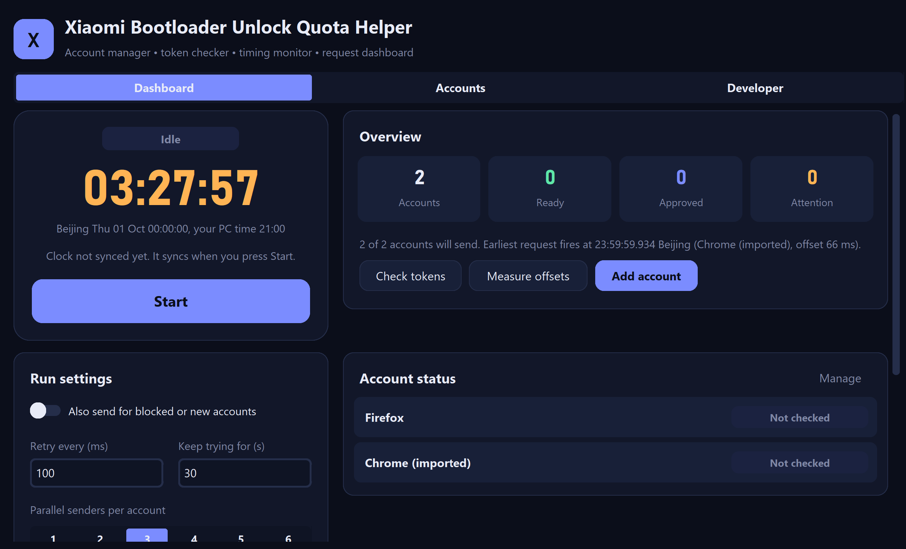

# Xiaomi Bootloader Unlock Quota Helper – GUI, CLI and Android App

[](https://github.com/haseebno1/xiaomi-unlock-helper/stargazers)
[](LICENSE)


A free, open-source helper for the official Xiaomi bootloader unlock request on **Xiaomi, Redmi and POCO** phones (HyperOS / MIUI). It manages your Xiaomi Community accounts, checks tokens, syncs to Beijing time over NTP, and sends your request the moment the daily quota resets (**00:00 Beijing time, UTC+8**).

Helps with:
- "Quota limit reached" in the Xiaomi Community app
- "Couldn't unlock. Try again after X days"
- "Apply for unlocking permission" failing or timing out



> **Disclaimer.** This is an unofficial community tool and is not affiliated with Xiaomi. It uses undocumented endpoints that can change or stop working at any time, and automated requests may be against Xiaomi's terms of service. You use it entirely at your own risk. Your token gives full access to your Xiaomi Community account, so never share it, post it in an issue, or commit it. The tool only requests *permission*: it does not unlock the phone and **cannot bypass the 7, 14 or 30-day waiting period**.

## Contents
- [Features](#features)
- [Which version should I use?](#which-version-should-i-use)
- [Requirements](#requirements)
- [Install (Windows, macOS, Linux)](#install-windows-macos-linux)
- [Get your token](#get-your-token)
- [Use the GUI](#use-the-gui)
- [Use the CLI](#use-the-cli)
- [Android app (APK)](#android-app-apk)
- [Settings explained](#settings-explained)
- [Status messages](#status-messages)
- [How it works](#how-it-works)
- [After you are approved](#after-you-are-approved)
- [Tips for best results](#tips-for-best-results)
- [Security and privacy](#security-and-privacy)
- [Troubleshooting](#troubleshooting)
- [Project structure](#project-structure)
- [Contributing](#contributing)
- [License](#license)

## Features
- **Dashboard:** live countdown to Beijing midnight, plus counts of accounts that are ready, approved or need attention
- **Account manager:** add multiple accounts, switch each on or off, import from `token.txt`, Firefox cookies or a Chrome login (desktop GUI)
- **Token checker:** verify tokens before the run so you don't waste your window
- **Timing monitor:** NTP clock sync and per-account network delay (offset) measurement
- **Configurable run settings:** retry interval (ms), retry duration (s), 1–6 parallel senders per account
- **Options:** optionally send for blocked or new accounts
- **Three interfaces:** responsive desktop GUI, scriptable CLI, and an Android app with in-app browser login
- **Cross-platform:** Windows, macOS, Linux and Android

## Which version should I use?

| | File | Runs on | Best for |
|---|---|---|---|
| **GUI** | `xiaomi_quota_helper.py` | Windows, macOS, Linux | Most desktop users |
| **CLI** | `xiaomi_quota_cli.py` | Windows, macOS, Linux, Termux, servers | Headless machines, VPS, automation |
| **Android app** | `android/` (built as an APK) | Android 7.0+ | Running from your phone |

All three share the same engine (`core.py`). The desktop GUI and CLI also share `config.json`. The Android app keeps its own accounts in its private storage.

## Requirements
- A Xiaomi account with an active Xiaomi Community login (<https://new.c.mi.com/global>)
- A stable internet connection and a correct system date and time zone
- **Desktop:** Python 3.9 or newer
- **Android app:** Android 7.0 or newer
- UDP port 123 open for NTP time sync

## Install (Windows, macOS, Linux)

```bash
git clone https://github.com/haseebno1/xiaomi-unlock-helper.git
cd xiaomi-unlock-helper
python3 -m venv venv
source venv/bin/activate          # Windows: venv\Scripts\activate
pip install -r requirements.txt
pip install -r requirements-optional.txt   # optional: browser imports (GUI)
```

Per platform:
- **Windows:** install Python from python.org and tick *Add Python to PATH*. Nothing else is needed.
- **macOS:** use Python from python.org or `brew install python-tk`. Apple's built-in Python ships an outdated Tk.
- **Linux:** install Tk first: `sudo apt install python3-tk` (Debian/Ubuntu) or `sudo dnf install python3-tkinter` (Fedora).
- **Android:** see [Android app (APK)](#android-app-apk). You can also run the CLI in Termux:
  ```bash
  pkg install python git
  git clone https://github.com/haseebno1/xiaomi-unlock-helper.git && cd xiaomi-unlock-helper
  pip install urllib3 ntplib
  ```
  Keep the screen on and disable battery optimization for Termux, otherwise Android may pause it before midnight.

## Get your token

The token is the value of the `new_bbs_serviceToken` cookie.

**On a computer**
1. Log in at <https://new.c.mi.com/global> in a desktop browser.
2. Open DevTools, then *Application* (Chrome) or *Storage* (Firefox), then *Cookies*.
3. Copy the value of `new_bbs_serviceToken`.

**On Android**
- **Easiest:** use the Android app's **Log in (browser)** button. It reads the token from Android's cookie store for you.
- **Alternative:** in Firefox for Android, install a cookie manager add-on (for example Cookie-Editor), log in to the site, and copy the cookie value.
- Mobile Chrome has no DevTools, so you cannot read the cookie there without remote debugging from a PC.

Tokens expire. If a check shows **Cookie expired**, log in again and replace the token. Logging out of the website also invalidates it.

## Use the GUI

```bash
python xiaomi_quota_helper.py
```

1. **Accounts** tab: *Add account* or *Import*, then paste the token.
2. *Check tokens* should show **Ready**. *Measure offsets* fills in each account's offset; adjust by hand if you like.
3. **Dashboard** tab: review the run settings, then press **Start** before midnight Beijing time. The app syncs the clock, waits, and sends on time.
4. Keep the app open and the computer awake until it logs *Run finished*.

The window is responsive: the dashboard switches between one and two columns, and the Accounts tab has search, *Enable all*, *Disable all* and *Remove expired*. **Developer** shows diagnostics you can copy when reporting a problem. `Ctrl+N` adds an account.

## Use the CLI

```bash
python xiaomi_quota_cli.py add Main --offset 66     # prompts for the token (hidden)
python xiaomi_quota_cli.py list
python xiaomi_quota_cli.py check
python xiaomi_quota_cli.py measure
python xiaomi_quota_cli.py run                      # waits for Beijing midnight
python xiaomi_quota_cli.py run --only Main --senders 3 --interval 80 --window 30
python xiaomi_quota_cli.py enable all | disable Main | remove Main
```

| Command | What it does |
|---|---|
| `add NAME [--token T] [--offset MS]` | Save an account (prompts for the token if `--token` is omitted) |
| `list` | Show saved accounts, offsets and on/off state |
| `check` | Query each account's unlock status |
| `measure` | Measure round-trip time and set each offset to half of it |
| `run [--only NAME ...]` | Sync the clock, wait for Beijing midnight, then send |
| `enable` / `disable` `NAME\|all` | Switch accounts on or off |
| `remove NAME` | Delete an account |

`run` options: `--interval MS`, `--window SECONDS`, `--senders 1-6`, `--allow-blocked`. Use `--config path/to/config.json` to keep accounts elsewhere. `run` also works under `tmux` or `screen` on a server, and Ctrl+C stops it.

## Android app (APK)

A native Android app (built with Kivy) reuses the same `core.py` engine. It has **Dashboard**, **Accounts** and **Log** tabs, plus **Log in (browser)**: an in-app web login that reads your token straight from Android's cookie store, so you never copy cookies by hand.

> The Android app is new and has had limited testing. If something breaks, please open an issue and include the contents of the app's Log tab.

### Get the APK
- **From GitHub Releases:** if a release is published, download the `.apk` from the repository's **Releases** page.
- **From GitHub Actions:** open the **Actions** tab, choose *Build Android APK*, press **Run workflow**, and download the `xiaomi-quota-helper-apk` artifact (about 10 to 25 minutes on the first build). Pushing a tag such as `v1.0.0` also attaches the APK to a Release.
- **Locally (Linux or WSL):**
  ```bash
  pip install buildozer "cython<3"
  cp core.py android/ && cd android && buildozer android debug
  ```
  The APK appears in `android/bin/`.

### Install and use
1. Copy the APK to your phone and open it. Allow *Install unknown apps* when asked. Play Protect may warn because this is an unsigned debug build.
2. **Accounts** tab, then **Log in (browser)**, sign in to the Xiaomi Community, and press **I'm logged in - get token**. (Or use **Add account** and paste a token.)
3. **Dashboard**: *Check tokens*, *Measure offsets*, then **Start** before midnight Beijing time.
4. **Keep the app open with the screen on** until *Run finished*. While a run is active the app keeps the screen awake and holds a wake lock.
5. Tap **Battery settings** and exempt the app from battery optimization, or Android may pause it before midnight.

### Android limitations
- There is no background service in this version, so don't swipe the app away or lock the screen manually during a run.
- Phone networks have more jitter than a wired PC, so timing is less precise. Measure your offset on the same connection you will use.
- Accounts are stored in the app's private storage and are not shared with the desktop `config.json`.

## Settings explained

| Setting | Default | Meaning |
|---|---|---|
| Retry every (ms) | 100 | Delay between requests from one sender. Minimum 20. |
| Keep trying for (s) | 30 | How long each sender keeps retrying after the send time. |
| Parallel senders | 2 | Simultaneous connections per account (1 to 6). More senders raise the chance of landing a request on time but send more traffic. |
| Offset (ms) | 0 | Per-account head start. A request is sent at `target - offset`, so it *arrives* at midnight. *Measure offsets* sets it to half the median round-trip time. |
| Also send for blocked or new accounts | off | By default accounts in cooldown or under 30 days are skipped. |

### Config file

Accounts and settings are stored in `config.json` next to the scripts (desktop) and are git-ignored. See `config.example.json`:

```json
{
  "accounts": [
    {"id": "1", "name": "Main", "token": "PASTE_new_bbs_serviceToken_HERE", "offset_ms": 66, "enabled": true}
  ],
  "settings": {"allow_blocked": false, "interval_ms": 100, "window_s": 30, "senders": 2}
}
```

## Status messages

| Status | Meaning |
|---|---|
| Ready | Token works and the account can apply |
| Blocked (cooldown) | The account is in a waiting period |
| Account under 30 days | The Xiaomi account is too new |
| Already approved | Permission was already granted (a deadline may be shown) |
| Cookie expired | The token is no longer valid, so log in again |
| Limit reached until ... | The daily quota ran out; try again after the date shown (Month/Day) |
| Finished (not approved) | The retry window ended without approval |
| Network error | The request failed; check your connection |

## How it works
1. NTP gives the exact offset of your clock; a monotonic timer keeps time between syncs, and the clock is re-synced 15 minutes and 1 minute before the target.
2. The target is the next 00:00:00 in UTC+8. Each account sends at `target - offset`.
3. Each sender warms up its connection 3 seconds early, then sends every *interval* ms for *window* seconds until approved, limited, blocked, or the cookie expires.
4. When one sender gets a final answer, that account's other senders stop. Other accounts keep running independently.

## After you are approved
- Approval only grants *permission*. It does not unlock the phone.
- Use *Check tokens* later to see the approval's expiry date.
- Sign in with the **same Xiaomi account** in the official Mi Unlock Tool on a PC. The account must also be bound to the phone under *Settings, Developer options, Mi Unlock status*.
- The tool will show any remaining waiting period before you can unlock.
- Unlocking erases all data on the phone, so back up first.

## Tips for best results
- Run *Check tokens* a few minutes before midnight so you know every token is valid.
- Re-run *Measure offsets* on the same network and time of day you will use.
- Keep the computer or phone awake, plugged in and on a stable connection.
- Close VPNs and heavy downloads that add network delay.
- Start the run at least 10 minutes before midnight Beijing time so the clock sync finishes.

## Security and privacy
- Tokens are stored **in plain text** in `config.json` (desktop) or the app's private storage (Android). Anyone with the token can act as your account.
- The app only talks to Xiaomi's servers and public NTP servers.
- Never post your token or `config.json` in an issue, screenshot or chat. If one leaks, log out of that account on the website to invalidate it.
- `config.json`, `token.txt` and `timeshift.txt` are listed in `.gitignore` so they are not committed by accident.

## Troubleshooting
- **Cookie expired:** log in again and replace the token.
- **NTP servers fail:** check that UDP port 123 is not blocked. The app needs at least one server to respond.
- **`externally-managed-environment` on Linux or macOS:** use the virtual environment shown above.
- **`No module named tkinter` on Linux:** install `python3-tk` (see the install section).
- **Fonts look different:** the GUI picks Segoe UI, Helvetica Neue or DejaVu Sans per OS. Edit `FONTS` in the GUI file to change it.
- **Firefox cookie import fails:** close Firefox and retry, or paste the token with *Add account*. A snap-installed Firefox on Linux may keep cookies in a location the importer does not check.
- **Android: browser login finds no token:** make sure you are fully logged in before pressing the button, or paste the token instead.
- **Android: the app was paused:** keep the screen on and exempt the app from battery optimization.
- **APK build fails in GitHub Actions:** open the failed step in the run log; the last lines usually show the cause. Include them when opening an issue.

## Project structure
```
core.py                      shared engine: NTP clock, Xiaomi API client, constants
xiaomi_quota_helper.py       desktop GUI (customtkinter)
xiaomi_quota_cli.py          command-line interface
android/main.py              Android app (Kivy)
android/buildozer.spec       APK build configuration
.github/workflows/           GitHub Actions workflow that builds the APK
config.example.json          sample config (the real config.json is git-ignored)
requirements.txt             required packages
requirements-optional.txt    optional packages for browser imports
```

## Contributing
Issues and pull requests are welcome. When reporting a problem, include your OS, Python version (or Android version), the steps you took, and the activity log with any tokens removed.

## License
Licensed under the [MIT License](LICENSE). Author: [Abdul Haseeb](https://github.com/haseebno1).
